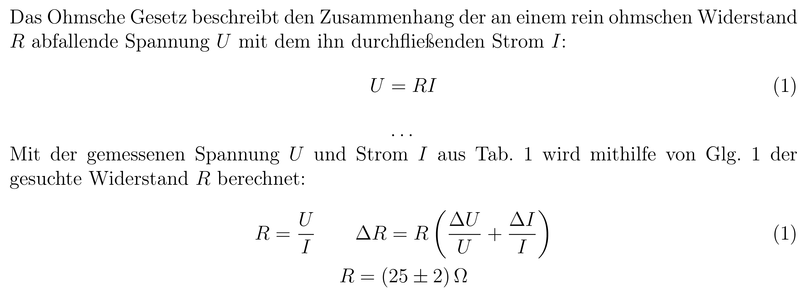
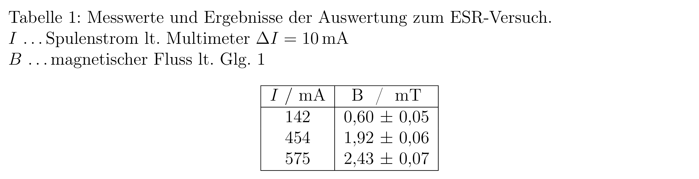

# Labor Vorlage

Dies ist eine Latex-Vorlage für die Labore des Physik-Bachelors an der TU Graz & KF Graz.

Fertige Protokolle, welche mit dieser Vorlage gefertigt wurden sind auf [https://www.student.tugraz.at/goessl/](https://www.student.tugraz.at/goessl/) einsehbar.
Ein Beispielprojekt befindet sich im Unterordner [examples/tu6_transformator/](examples/tu6_transformator/).

 - [Vorbereitung](#vorbereitung)
     - [Deckblatt](#deckblatt)
     - [main.tex](#maintex)
 - [Anwendung](#anwendung)
     - [Text & Mathematik](#text--mathematik)
     - [Werte](#werte)
     - [Bilder](#bilder)
     - [Tabellen](#tabellen)
     - [Bibliography](#bibliography)
 - [Entscheidungen & Begründungen, Anmerkungen](#entscheidungen--begr%C3%BCndungen-anmerkungen)
     - [Beim Protokollieren zu beachten](#beim-protokollieren-zu-beachten)
     - [(Eigene) Konventionen](#eigene-konventionen)
     - [Anmerkungen](#anmerkungen)
 - [Danksagung & hilfreiche Links](#danksagung--hilfreiche-links)
 - [Lizenz (MIT)](#lizenz-mit)

## Vorbereitung

Es wird checklistenmäßig aufgezählt, wie dieses Template für ein Experiment aufgesetzt wird.

### Deckblatt

Das Deckblatt kann auch händisch ausgefüllt und dem Protokoll beigelegt werden. Bei den seit Corona standardmäßigen Onlineabgaben ist es jedoch meist effizienter die Datei am PC zu bearbeiten.
Es sind die Deckblätter für das Labor 1 & 2 sowie die Fortgeschrittenenpraktika 1 & 2 als `.doc` und `.pdf` in dem Unterordner [cover](cover/) enthalten. Das passende, ausgefüllte Deckblatt wird in das Hauptverzeichnis gezogen, dessen Suffix entfernt (Dateiname nur mehr `Deckblatt.pdf`) und der verbleibende Ordner gelöscht.
 1. Übungstitel: Laut Rotationsschema, z.B. `TU1: Dünne Linsen`.
 2. Betreuer: Im Online-Verzeichnis ([TeachCenter](tc.tugraz.at) & [Moodle](moodle.uni-graz.at)) gibt es meist eine Datei mit den Betreuern der jeweiligen Experimente. Bei Unsicherheit in der Einheit nach dem Namen fragen. In den Onlinesystemen ([TU Graz online](online.tugraz.at) & [uni-graz online](online.uni-graz.at)) kann man notfalls in der Lehrveranstaltungsseite die beteiligten Personen durchsuchen; im [TU Graz online](online.tugraz.at) gibt es zusätzlich eine eigene Personensuche. Der Name ist ohne Titel anzugeben; z.B. `Gössl, Sebastian`; siehe [Konventionen](#eigene-konventionen).
 3. Gruppennummer: Laut Rotationsschema, z.B. `4`.
 4. Namen: Gruppenmitglieder lt. [Konvention](#eigene-konventionen) in alphabetischer Reihenfolge inklusive Kennzeichnung des Schriftführers. Sollte es keinen einzelnen Schriftführer geben, ist die Bezeichnung wegzulassen;. Z.B.

        Angermann, Leo
        Gössl, Sebastian (Schriftführer)

 6. Kennzahl: Kennzahl des Studiums. In den Onlinesystemen ([TU Graz online](online.tugraz.at) & [uni-graz online](online.uni-graz.at)) unter `Mein Studium > Meine Studien anzeigen` einsehbar; z.B. `UF 033 678` (Physik-Bachelor).
 7. Matrikelnummer: In der Reihenfolge der Namen.
 8. Datum: Tag, an welchem das Experiment durchgeführt wurde, im in Österreich gewohnten `DD.MM.YYYY`-Format.
 9. Semester: Im Format `YY[WS|SS]`; z.B. `22SS` für 2022 Sommersemester.

### main.tex

In der `main.tex`-Datei sind ein paar Felder wie im Deckblatt einzutragen, da diese in der Kopfzeile erscheinen werden:
 1. `\title`: Für den Titel wird das Format `[Labor] \\ [Experimentname]`, wie z.B. `Labor 2 \\ TU1: Dünne Linsen` um mit dem Titelblatt bzw. dem Rotationsschema einheitlich zu bleiben, verwendet.
    Labore:
    - `Labor 1`
    - `Labor 2`
    - `Fortgeschrittenenpraktikum 1`, abgekürzt `Fortprak. 1`
    - `Fortgeschrittenenpraktikum 2`, abgekürzt `Fortprak. 2`
 2. `\author`: Autor ist die Gruppe mit den Namen der Gruppenteilnehmer, im Format `Gruppe [N] \\ [Nachname] \& [Nachname]`; z.B. `Gruppe 4 \\ Angermann \& Gössl`.
 4. `\date`: Datum als `YY[WS|SS] \\ DD.MM.YYYY`.

Sollte die Kopfzeile einzeilig möglich sein (normalerweise nicht möglich da sich der Text überlappen würde), ist dies zu nutzen indem die Zeilenumbrüche durch einen Bindestrich ersetzt werden und die `headheight` des Packages `geometry` beim Importieren von `28pt` auf `15pt` verringert wird. 

Da zum Zeitpunkt des Verfassens dieser Vorlage noch immer eine viele Labore im Onlinemodus geführt werden, ist das Kapitel `Anmerkung` standardmäßig in der Vorlage enthalten. Es folgen die Standardfloskeln für ein Videolabor und eine Hintereinanderausführung:

> Dies ist ein 3rd-Hand Protokoll. Das Experiment wurde nicht vom Autor durchgeführt, sondern hat dieser eine Videoaufzeichnung \cite{teachcenter} vom Experiment protokolliert. Weiters stammen das Titelblatt (vom Autor ausgefüllt) und die ersten drei Kapitel (inhaltlich) ebenfalls aus diesem Verzeichnis.

> Aufgrund der herrschenden COVID-19-Maßnahmen, wurde die Laborübung nicht von beiden Gruppenmitglieder gleichzeitig durchgeführt, sondern zuerst von Angermann, Leo und anschließend erneut von Gössl, Sebastian. Beide führten alle Aufgaben vollständig durch und werteten ihre jeweiligen Daten, über gleiche Rechenwege, getrennt aus. Wird nur ein Ergebnis angegeben, ist es nur dies des Schriftführers (Zwischenergebnisse \& Diagramme, zu besseren Übersicht), ansonsten werden die jeweiligen Ergebnise der Laboranten nebeneinander angeführt, so dass diese verglichen werden können.

## Anwendung

Hier noch kurz die empfohlenen Design Patterns für die grundlegenden Bausteine eines Protokolls:

### Text & Mathematik

Labels von Gleichungen mit vorangestelltem `eq:`.

Text ohne spezielle Effekte, maximal um wichtige Ausdrücke herauszuheben `\emph{}` verwenden.

Mathematische Ausdrücke im Fließtext mit `$` einklammern. Einzeilige Rechnungen in der Umgebung `equation`, mehrzeilige im `gather` oder wenn nötig `align` (oder `gather` mit eingebettetem `aligned` falls in den ausgerichteten Rechnungen zentrierte Zeilen benötigt werden).

Nicht verwendete Gleichungen, wie z.B. Herleitungen in den Grundlagen, welche im Fließtext eingebettet sind, werden nicht nummeriert. Werden Gleichungen, meist aus den Grundlagen, verwendet sind diese zu nummerieren. Werden Gleichungen erneut ausgeschrieben, meist wegen Umformungen oder in der Auswertung mit Unsicherheitsberechnung, sind diese mit der gleichen Nummer zu kennzeichnen (Erste normal mit `\label{eq:label}` und die erneute Angabe mit `\tag{\ref{eq:label}}`).

Bei angewandten Rechnungen sind diese als Formel in eine Zeile zu schreiben, und darunter die erhaltenen Werte. Wenige Ergebnisse können in eine Zeile mit `\qquad` getrennt geschrieben werden.

Wird im Math-Mode Text benötigt, wird `\text{}` verwendet.

Bei der Formeln hat die Unsicherheitsberechnung direkt gleichzeitig zu geschehen und die Quellen von errechneten Werten hat immer unmittelbar nachvollziehbar sein.

Operationen sind mit `\DeclareMathOperator{\code}{text}` zu. Oft gebrauchte, jedoch nicht standardmäßig implementierte Operatoren wurden bereits hinzugefügt:
 - `arsinh, arcosh, artanh` (Areafunktionen)
 - `atan2` (erweiterter Arkustangens)
 - `grad`, `div`, `rot` (Differenzialoperatoren der Vektoranalysis)
 - `Vol`, `Res` (Integraloperatoren der Vektoranalysis)
 - `dom`, `ran` (Definitions- & Bildmenge; domain & range)
 - `Avg`, `Var`, `StD`, `CoV` (Statistik)
 - `sgn`, `tr` (Vorzeichen- & Spurfunktion)

Mathematische Abschnitte wie
 - `definition`
 - `proposition`
 - `bemerkung`
 - `lemma`
 - `korollar`
 - `satz`
 - `theorem`

sind bereits definiert.

Beispiel: siehe im nächsten Unterkapitel.

### Werte

Werte mit Einheiten in `\SI{}{}` (z.B. `\SI{2,0+-0,4}{\m}` für zwei Meter mit kleiner Unsicherheit). Einheiten alleine in `\si{}` (z.B. `\si{\m}` für Meter). Als Dezimalzeichen ist das Komma eingestellt.

Unsicherheiten so gut wie immer absolut mit `+-` zum Wert dazu angeben, außer z.B. in der Diskussion zum Vergleich relativ.

Oft gebrauchte, jedoch nicht standardmäßig implementierte Einheiten wurden bereits hinzugefügt:
 - `ua` (Astronomische Einheit lt. ISO80000-1 2016-06-15 Tab. 6)
 - `VA` (Voltampere)
 - `var` (Var, Blindwatt)
 - `U` (Umdrehungen)
 - `px` (Pixel)
 - `€` (Euro)
 - `dgt.` (Ziffern, digits)

Ansonsten mit `\DeclareSIUnit\code{Text}` hinzufügen, nachdem die [siunitx-Dokumentation](ctan.org/pkg/siunitx) durchsucht wurde, ob die gesuchte Einheit nicht bereits vorhanden ist.

Einheitenlose Werte in `\num{}`.

Z.B.:

    Das Ohmsche Gesetz beschreibt den Zusammenhang der an einem rein ohmschen Widerstand $R$ abfallende Spannung $U$ mit dem ihn durchfließenden Strom $I$:
    \begin{equation}
        U = R I
        \label{eq:ohm}
    \end{equation}
    ...
    Mit der gemessenen Spannung $U$ und Strom $I$ aus Tab. \ref{tab:messwerte} wird mithilfe von Glg. \ref{eq:ohm} der gesuchte Widerstand $R$ berechnet:
    \begin{gather}
        R = \frac{U}{I} \qquad \Delta R = R \left( \frac{\Delta U}{U} + \frac{\Delta I}{I} \right)
        \tag{\ref{eq:ohm}} \\
        R = \SI{25+-2}{\ohm}
        \nonumber
    \end{gather}

Weiterführend: [siunitx-Dokumentation](ctan.org/pkg/siunitx).

### Bilder

Labels mit vorangestelltem `fig:`.

Bilder sind in eine zentrierte `figure` einzubetten. Diese werden am Besten am Ende, wenn Text, Rechnungen, Tabellen & Abbildungen im Dokument sind und man direkt vor der Kompilierung steht, so weit wie möglich, ohne den Lesefluss zu stören, verschoben bis das Dokument möglichst kompakt ist.

Die Breite ist nur bei Bedarf zu verändern; z.B. `width=0.5\linewidth`.

Der Dateiname ist ohne Endung anzugeben.

Beschreibungen sind bei allen Grafiken zu verwenden so dass diese ohne den Text zu Lesen beim Durchblättern der Arbeit halbwegs verständlich sind.

Labels sind nur bei später auch referenzierten Grafiken, mit `\ref{}` zu verwenden.

    \begin{figure}[H]
        \centering
        \includegraphics[width=\linewidth]{dateiOhneEndung}
        \caption{Beschreibung}
        \label{fig:label}
    \end{figure}

Bei mehreren Grafiken nebeneinander sind `subfigure`s in einer `figure` zu verwenden. Bei Kombination mit anderen Umgebungen wie Tabellen `minipage`s.

Weiterführend: [Overleaf: Inserting Images](www.overleaf.com/learn/latex/Inserting_Images).

### Tabellen

Labels mit vorangestelltem `tab:`.

Tabellen sind, ähnlich wie Grafiken, in einem `H`-`table`, welcher mit einer `caption` und bei Bedarf einem `label` versehen wird, einzubetten. Die Zellen sind in einem `tabular`, mit `|`s und `\hbar`s einfach umrandet und einer abgetrennten Kopfzeile, einzutragen.

Für Spalten mit mathematischen Ausdrücken sind die links, zentriert und rechts ausgerichteten Makros `L C R` bereits implementiert; für Spalten mit Werten ist das mit `siunix` bereitgestellte `S` (für kommaausgerichtete Zahlen). Bei letzeren sind ist die Anzahl der Ziffern vor (`[N]`) und nach (`[M]`) dem Dezimaltrennzeichen mit anzugeben (`S[table-format=[N].[M]]`), da dies nicht automatisch erkannt wird und die Spalten deshalb ohne diese Angabe meist zu breit und unsymmetrisch werden.

Kopfzeilen sind den Universität-Richtlinen nach im Format `{$x \ / \si{\u}$}` zu halten (`{}` damit der Mathemodus `$$` in `S`-Spalten funktioniert).

Bei so gut wie allen Tabellen ist in der Beschreibung auf die Quelle zu referenzieren, z.B. `lt. Glg. x & Tab. y` (Herkunft der Größen, welche in der Gleichung verwendet werden, nur wenn es eine andere als die selbe Tabelle ist) oder `lt. Messgerät x`, und im Fließtext auf den Eintrag in die Tabelle zu verweisen, z.B. `anschließend werden die Konstanten mithilfe von Glg. \ref{eq:formel} und den Messwerten aus Tab. \ref{tab:messwerte} ausgerechnet und in Tab. \ref{tab:ergebnisse} eingetragen`.

Z.B.

    \begin{table}[H]
        \centering
        \caption{Messwerte und Ergebnisse der Auswertung zum ESR-Versuch. \\
        $I$ \dots Spulenstrom lt. Multimeter $\Delta I = \SI{10}{\mA}$ \\
        $B$ \dots magnetischer Fluss lt. Glg. \ref{eq:spule}}
        \label{tab:spule}
        \begin{tabular}{| S[table-format=3.0] | S[table-format=1.2] @{ $\pm$ } S[table-format=1.2] |}
            \hline
            {$I \ / \ \si{\mA}$} & \multicolumn{2}{c|}{B \ / \ \si{\milli\tesla}} \\
            \hline
            142     & 0,60 & 0,05 \\
            454     & 1,92 & 0,06 \\
            575     & 2,43 & 0,07 \\
            \hline
        \end{tabular}
    \end{table}

Weiterführend: [Overleaf: Tables](www.overleaf.com/learn/latex/Tables).

### Bibliography

Zitieren mit `\cite{}` z.B. `$F=\SI{2,0+-0,5}{\N}$ lt. \cite[Tab 23.11]{boege}`.

Die TeachCenter-Kurse & Moodle-Kurse sind ebenfalls bereits in der Bibliography enthalten, jedoch ist der Link zu aktualisieren, da jedes Semester ein neuer Kurs und damit eine neue Adresse angelegt wird.

In der Bibliography-Datei wurden bereits mehrere möglicherweise nützliche Bücher eingetragen. Unter anderem die in Experimentalphysik 1 & 2 bereitsgestellten Demtröder, die Wiley-Custom-Version von Krane's Modern Physics und mehrere HTL-Bücher, welche sehr oft nützliche Vergleichswerte enthalten. Es wurden immer die bereitsgestellten Versionen/Jahre verwendet (Demtröder als PDF, manche HTL Bücher als Softcover), außer neuere Editionen sind über den Institutional-Login zugänglich.

## Entscheidungen & Begründungen, Anmerkungen

### Beim Protokollieren zu beachten

 - Protokolle sind im Präsenz (Gegenwart) zu verfassen.
 - Da dies meist falsch gemacht wird, ist besonders auf richtiges Runden zu achten. Kurzfassung der vorgegebenen Richtlinien:
    1. Unsicherheit bei führender 1 oder 2 auf zwei Stellen, ansonsten (führende 3-9) auf eine Stelle aufrunden.
    2. Wert auf gleich viele Stellen runden.
    - z.B.

          12,345678 +- 0,23456 (Unsicherheit aufrunden)
          12,345678 +- 0,24    (Wert gleich weit wie Unsicherheit runden)
          12,34 +- 0,24        (beide Zahlen haben gleich viele Nachkommastellen)

### (Eigene) Konventionen

 - Das Semester sollte generell immer als `[WS|SS]`, z.B. `21WS` angegeben werden, da dieses Format kürzer, trotzdem gut leserlich und beim Dateimanagment nützlicher ist. Tagesangaben im in Österreich üblichen `DD.MM.YYYY`, Uhrzeiten in 24h-Format `hh:mm`; oder im ISO8601 extended format `YYYY-MM-DD` bzw. `Thh:mm`. TODO: Evtll. komplett ISO8601? Kompatible Opensource-Alternative?

 - Namen werden den [Regeln für die alphabetische Katalogisierung](https://de.wikipedia.org/wiki/Regeln_f%C3%BCr_die_alphabetische_Katalogisierung) entsprechend im Format `Nachname, Vorname` (bei Spezialfällen, wie `Peter von der Mühll > Mühll, Peter von der` bei Anahme der deutschen Sprache als Herkunft lt. §314a, ist auf die Regeln zu achten). Titulaturen sind nicht anzusetzten (§326 in der 2. Auflage, 2006). Dies verbessert die Orientierung in Listen, Vereinfacht das Lesen, erfordert weniger Nachbesserungen und wirkt dem in Österreich herschenden Titelfetischismus entgegen. TODO: RAK ist nicht mehr aktuell, RDA ist kostenpflichtig. Opensource-Alternative finden.

### Anmerkungen

 - Da das Protokollieren insgesamt viel Zeit in Anspruch nimmt, wurde hier eher auf Effizienz beim Schreiben als auf Best-practice-Implementierungen geachtet (z.B. wurden schlicht alle möglicherweise relevanten Packages inkludiert).
 - Als Sprache für dieses Readme wurde Deutsch, der Lehrveranstaltung entsprechend, gewählt, so dass dies jeder Besucher der Lehrveranstaltung auch verstehen und an eigenen Projekten anwenden kann. Im Projekt selber (Dateinamen, Kommentare, etc.) wird jedoch, gleich wie die Befehle in Latex, Englisch verwendet.
 - Der Autor hat sich Latex mit verschiedenen Quellen selbst beigebracht und ist ein Amateur, weshalb hier trotz aller Bemühungen nicht von hochwertigem Latex auszugehen ist.

## Danksagung & hilfreiche Links

Der größte Dank geht an **Angermann, Leo**, welcher mit dem Autor zusammen als Gruppe die Einführungen und ersten beiden Laborlehrveranstaltungen besucht hat. Die zahlreichen Protokolle, durch welche diese Vorlage entstanden ist, wurden mit ihm gemeinsam verfasst. Ohne seine Hilfe wären solch ausgezeichnete Abgaben und auch Durchführungen nicht möglich gewesen.

Diese Vorlage wurde hauptsächlich auf Overleaf mithilfe dessen
[sehr nützlichen Dokumentation](https://www.overleaf.com/learn), in welcher schnell und übersichtliche Erklärungen gefunden werden können, entwickelt.

Für ausführlichere und genauere Angaben sind die Dokumentationen der Packages auf [ctan.org](https://ctan.org/) zu verwenden.

## Lizenz (MIT)

MIT License

Copyright (c) 2021 Sebastian Gössl

Permission is hereby granted, free of charge, to any person obtaining a copy
of this software and associated documentation files (the "Software"), to deal
in the Software without restriction, including without limitation the rights
to use, copy, modify, merge, publish, distribute, sublicense, and/or sell
copies of the Software, and to permit persons to whom the Software is
furnished to do so, subject to the following conditions:

The above copyright notice and this permission notice shall be included in all
copies or substantial portions of the Software.

THE SOFTWARE IS PROVIDED "AS IS", WITHOUT WARRANTY OF ANY KIND, EXPRESS OR
IMPLIED, INCLUDING BUT NOT LIMITED TO THE WARRANTIES OF MERCHANTABILITY,
FITNESS FOR A PARTICULAR PURPOSE AND NONINFRINGEMENT. IN NO EVENT SHALL THE
AUTHORS OR COPYRIGHT HOLDERS BE LIABLE FOR ANY CLAIM, DAMAGES OR OTHER
LIABILITY, WHETHER IN AN ACTION OF CONTRACT, TORT OR OTHERWISE, ARISING FROM,
OUT OF OR IN CONNECTION WITH THE SOFTWARE OR THE USE OR OTHER DEALINGS IN THE
SOFTWARE.
